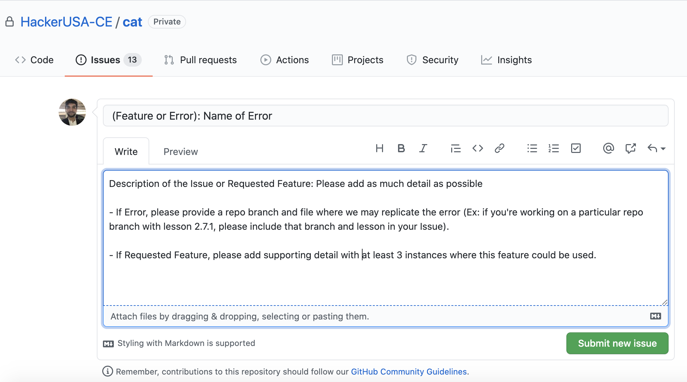

# Welcome to our CAT Documentation!

## For information on creating a Github personal oAuth token, click on the link below and follow the step-by-step tutorial!
*   [Click here for instructions on creating your Github Personal oAuth token!](github-personal-oAuth/github-personal-oAuth.md)


# Components

### Root Components

* `Document`
    * The required root component for creating documents
* `Presentation`
    * The required root component for creating presentations
* `Pulse`
    * The required root component for creating pulse assessments
* `EOCCheckIn`
    * The required root component for creating End of Course Check-Ins


### Typography

* `H1-H4`
    * For page headings

* `P`
    * For paragraphs

* `Span`
    * For inline text. Accepts props:
        * `bold` - when true or present, makes the Span bold
        * `italic` - when true or present, makes the Span italic
        * `keyword` - changes the font of the Span to denote a programming keyword
        * `style` - a styling object

<!-- * `TextBox`
    * Creates a text box. Accepts `x`, `y`, `width`, and `height` props
    * Any inline elements (`Span`'s) must be rendered inside of a TextBox
    > Other Typography components will create their own TextBox if they are not already rendered inside of one -->

* `Link`
    * Creates a link. Accepts props:
        * `href` - a link to follow when the link is clicked
        * `target` - any regular target attribute such as `_self` or `_blank` to choose whether you want the link to open in the same tab or a new tab

* `Citation`
    * Added a Citation Element that allows for centered text under Images, making it simple to cite Image sources.

* Wanting to use brackets {} in your Typography elements? [Click here to see the notation!](misc-docs/StringLiteral-Notation.md)

### List

* `Ol`
    * For ordered lists

* `Ul`
    * For un-ordered lists

* `Li`
    * For list items

### List

* `Table`
    * For tables. Accepts props:
        * `width` - (optional) the width of the image
        * `height` - (optional) the height of the image
        * `x` - (optional) the horizontal position of the Image
        * `y` - (optional) the vertical position of the Image

* `Row`
    * For table rows

* `Cell`
    * For table cells

### Media

* `Image`
    * For images. Accepts props:
        * `path` - path to an image to display; should be relative to the current file
        * `buffer` - alternatively, you may supply an image buffer
        * `width` - (optional) the width of the image
        * `height` - (optional) the height of the image
        * `size` - (optional) sets with and height simultaneously  
        * `x` - (optional) the horizontal position of the Image
        * `y` - (optional) the vertical position of the Image
        * `webOnlyHref` - (optional) hyperlink to external web source, creating a link to be accessed by clicking the Image. NOTE: This property is only available for web HTML usage (will NOT apply to any exported formats)
    * The image will be sized:
        * By default: according to the size in the file, scaled down to the width of the page
        * If one dimension is provided, (width or height) scaled relative to that dimension to maintain aspect ratio
        * If both dimensions are provided, (width and height) arbitrarily, changing the aspect ratio if necessary 
    * [Click here to see examples!](misc-docs/Image.md)

* `Icon`
    * Creates an icon. Accepts all the props of `Image`
        * `name` - the name of the icon to display (browse a list here: https://icons.getbootstrap.com/)
        * `color` - the color of the icon
        * `width` - (optional) the width of the image
        * `height` - (optional) the height of the image
        * `x` - (optional) the horizontal position of the Image
        * `y` - (optional) the vertical position of the Image

* `CodeSnippet`
    * For visual code blocks. Accepts props:
        * `title` - (optional) a title for the code snippet
        * `language` - the language of the snippet, `js` or `py` (more can be added)
        * `width` - (optional) the width of the resulting code block. Set to 'inherent' to scale to the content size. By default, this scales to the size of the parent container.
        * `height` - (optional) the height of the resulting code block. Set to 'inherent' to scale to the content size. By default, this scales to the size of the parent container.
        * `size` - (optional) sets with and height simultaneously  
        * `x` - (optional) the horizontal position of the code block
        * `y` - (optional) the vertical position of the code block
        * `content` - (required) the content of the code snippet. Should be created using `Annotations`
    * Annotations - a namespace attached to CodeSnippet (`CodeSnippet.Annotations`) containing the following tools for creating code snippets:
        * Language tags, used to snippets: `js`, `html`, `css`, `jsx`, `python`, `typescript`
        * Highlighters, used to highlight sections of a snippet: `blueHighlight`, `redHighlight`, `greenHighlight`, `yellowHighlight`, `purpleHighlight`
        * Arrows, used to embed arrows in a snippet: `arrowLeft`, `arrowRight`
    Example: 
    ```jsx
        // Near the top of a file
        const { js, arrowRight, blueHighlight: b } = CodeSnippet.Annotations

        // ... later, inside of a slide, document, or other resource:
        <CodeSnippet content={js`
            ${b}function App(){${b}
                return (
                    <div>
      ${arrowRight()}   <h1>Hello World</h1>
                    </div>
                )
            }
        `}/>
    ```

* `LaTeX`
    * For formatting LaTeX math equations (see https://en.wikibooks.org/wiki/LaTeX/Mathematics). Accepts props:
        * `width` - (optional) the width of the resulting math snippet. Set to 'inherent' to scale to content size. By default, this scales to the size of the parent container.
        * `height` - (optional) the height of the resulting math snippet. Set to 'inherent' to scale to content size. By default, this scales to the size of the parent container.
        * `size` - (optional) sets with and height simultaneously  
        * `x` - (optional) the horizontal position of the math snippet
        * `y` - (optional) the vertical position of the math snippet
        * `content` - (required) the content of the LaTeX snippet as a string
    Example: 
    ```jsx
        <LaTeX content={`
            E = mc^2
            k_{n+1} = n^2 + k_n^2 - k_{n-1}
        `}/>
    ```
        
### Assessment
These visual elements will be omitted from static builds (docx, pdf, pptx) and will only be displayed in applicable html, canvas page, or canvas quiz builds.
* `Document` - the common required root where the Assessment components will exist within (see LessonCompanion Template examples with Document built in)

* `MultipleChoice`
    * For multiple choice questions. Accepts props:
        * `title` - (optional, only works for html and canvas pages) A title to display above the question
        * `children` - The content of the question and it's answers
* `Answer`
    * Defines an answer for the multiple choice question it is within. Accepts props:
        * `correct` - (optional) defines a correct answer
        * `feedback` - (optional) feedback to display if that answer is selected

* `CodeExercise`
    * For interactive, in-lesson coding exercises. Accepts optional props:
        * `title` - Used to give the exercise a unique title
        * `language` - javascript, html, css, python, jsx, or typescript
        * `instructions` - Instructions for the student to follow
        * `setup` - Define variables, methods, etc. that students will need to complete the exercise. Code here will not be visible to the student.
        * `starterCode` - Define any code you want the student to start with. Code here will be visible to the student.
        * `post` - Define any code that should always run after the exercise.
        * `test` - Test the student's submission here. You will have access to:             
            * Any variables from your "Set Up" and "Exercise"
            * A 'code' variable, which will be a string of the student's submission
                Create assertions using chai/chai-dom (like so):
                ```js
                    if(foo !== 'bar') throw Error("Define a variable named foo that's equal to 'bar'")
                ```                
                Code here will not be visible to the student.
        * `fileName`  - A string, used to define a the name of the virtual file the exercise is meant to represent. Only relevant when writing exporting and importing variables across exercises
        * `showConsole` - A boolean, whether or not to show the console log output. The default value depends on the language selected.
        * `showDOM` - A boolean, whether or not to show the DOM output. The default value depends on the language selected.
        * `html` - Define HTML code that should be added to the DOM automatically. Helpful for CSS or JavaScript exercises.
        * `entry` - Define an html variable to render on the DOM. Helpful for JSX exercises.

* `ShortAnswerExercise`
    * For short answer questions:
        * `title` - Used to give the exercise a unique title
        * `instructions` - Instructions for the student to follow
        * `sampleAnswer` - A sample answer for students to compare their answer to.

#### Assessment Template
* `LessonCompanion`
    * Document-based activity template used for full-page Assessment components (This template uses full-page width, allowing for large output windows in Activities and Lesson Companions)
       
## Presentation Specific
CAT has effective presentation components that provide reusable components to comprise consistent presentation material across all platforms.  The components in this Presentation Slide format are contained within the (`Presentation`) tag.
* `Presentation`  - Does not inherently have a parent container (NOTE: leads to error)

### Presentation/Slides Templates

* `Title`
    * A Slides Template used in the beginning of each presentation, creating the title slide. Required components:
        * `Slide` - The required second-level component for creating presentations. Required Slide Header props:
    * [Click here to see detailed documentation and examples!](Slide-Templates/TitleTemplate.md) 


* `LearningObjectives`
    * A Slides Template generally used after the Title component
    * [Click here to see detailed documentation and examples!](Slide-Templates/LearningObjectivesTemplate.md)
    

* `Code` 
    * A Slides Template used to create code-based presentation slides. Required components:
        * `Slide` - The required second-level component for creating presentations. Accepts internal components/Slide Header props:
            * `title` - The title prop of the slide
            * `subtitle` - The lesson name (commonly passed through a string variable)
            * `icon` - Creates an icon in the Slide Header, derived from Bootstrap Icons (see `Icons` in Media section above)
            * `background` - declare a background Image path prop to create a full sized Slide Image.
    * [Click here to see detailed documentation and examples!](Slide-Templates/CodeTemplate.md)
           

* `Media`
    * A Slides Template used to create media-based presentation slides. Required components:
        * `Slide` - The required second-level component for creating presentations. Accepts internal components/Slide Header props:
            * `title` - The title prop of the slide
            * `subtitle` - The lesson name (commonly passed through a string variable)
            * `icon` - Creates an icon in the Slide Header, derived from Bootstrap Icons (see `Icons` in Media section above)
            * `background` - declare a background Image path prop to create a full sized Slide Image.
    * [Click here to see detailed documentation and examples!](Slide-Templates/MediaTemplate.md)
            

* `Text`
    * A Slides Template used to create text-based presentation slides. Required components:
        * `Slide` - The required second-level component for creating presentations. Accepts internal components & Slide Header props:
            * `title` - The title prop of the slide
            * `subtitle` - The lesson name (commonly passed through a string variable)
            * `icon` - Creates an icon in the Slide Header, derived from Bootstrap Icons (see `Icons` in Media section above)
            * `background` - declare a background Image path prop to create a full sized Slide Image.
    * [Click here to see detailed documentation and examples!](Slide-Templates/TextTemplate.md)


* `Quiz`
    * A Quiz Template that serves as a mix between a quick lesson-assessment & an opportunity to start a conversation around a particular topic.  This template is typically used back-to-back, the first time to pose the question and the second time to present the answer (Click the link for examples). Required components:
        * `Slide` - The required second-level component for creating presentations. Accepts internal components & Slide Header props:
            * `title` - The title prop of the slide
            * `subtitle` - The lesson name (commonly passed through a string variable)
            * `icon` - Creates an icon in the Slide Header, derived from Bootstrap Icons (see `Icons` in Media section above)
            * `background` - declare a background Image path prop to create a full sized Slide Image.
    * [Click here to see detailed documentation and examples!](Slide-Templates/QuizTemplate.md)


* `Column`
    * A Column Template used to create presentation slides that can be broken upto 8 sections of desired sizes that must be explicity stated in the (`Slide`) component. NOTE: The size for each individual column must also be explicitly stated as a prop and must equal the size that was assigned in the parent (`Slide`) Header prop. (See Example By Clicking On The Link!). Required components:
        * `Slide` - The required second-level component for creating presentations. Accepts internal components & Slide Header props:
            * `title` - The title prop of the slide
            * `subtitle` - The lesson name (commonly passed through a string variable)
            * `icon` - Creates an icon in the Slide Header, derived from Bootstrap Icons (see `Icons` in Media section above)
            * `size` - Required size prop in Column Slide Header that all child column components must equal
            * `background` - declare a background Image path prop to create a full sized Slide Image.
    * [Click here to see detailed documentation and examples!](Slide-Templates/ColumnTemplate.md)


<!-- * `Slide`
    * The required second-level component for creating presentations. Required components: -->

* `SpeakerNotes`
    * Adds speaker notes to a presentation (must be rendered inside of a `Slide`)

* `Area`
    * A component used to position a group of related elements. 
    * Accepts props:
        * `width` - (optional) the width of the resulting code block
        * `height` - (optional) the height of the resulting code block
        * `x` - (optional) the horizontal position of the code block
        * `y` - (optional) the vertical position of the code block


# Drawing Engine
CAT has a powerful engine for programmatically creating SVG based, themeable components that behave consistently across platforms. Examples can currently be found under `templates/art`. It is exposed via a single function:

* `CircularDiagram`
    * Art Template that allows for a multipart circular diagram with various points through a single function. Required props:
        * `points` - takes in an array of the parts the circular diagram (see example below)
    * [Click here to see detailed documentation and examples!](Art-Templates/CircularDiagramTemplate.md)


* `EmphasizedPoint`
    * Art Template that creates a point of emphasis and attention to a particular topic, fundamental, or idea.
    * Must be used within a Parent container (Slide Template, Document, etc.)
    * [Click here to see detailed documentation and examples!](Art-Templates/EmphasizedPointTemplate.md)


* `Timeline`
    * Art Template that creates a timeline with date points. Required props:
        * `format` - The time format is required (example: `Timeline format="yyyy"` for timeline points noted in year format)
        * [Click here to see detailed documentation and examples!](Art-Templates/TimelineTemplate.md)


* `draw`
    * A function which can be used to draw an SVG component. It takes in a callback function as it's only argument, and returns a Component which can be rendered within any CAT assets.
    * `callback`
        * A function passed to draw which is used to draw an SVG to represent the component. It will be passed an object with the following properties:
            * `draw` - a drawing cursor whose methods can be found [here](https://svgjs.com/).
            * `styles` - a stylesheet object
            * `theme` - the theme object from `styles.js`
            * Any props passed to the component when it is rendered, including `children`


<br />
<br />

### Thank you for using CAT! If you experience any errors or if you would like to see a feature added to the tool, please submit an issue request with the format presented below:




