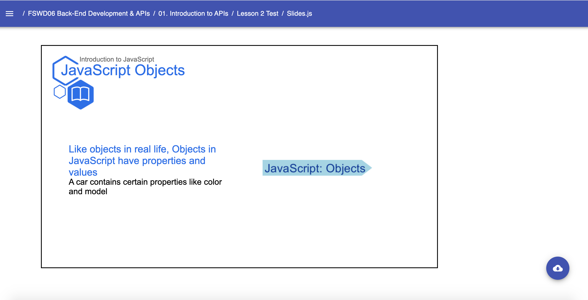

# Art Templates: Emphasized Point

* `EmphasizedPoint`
    * Art Template that creates a point of emphasis and attention to a particular topic, fundamental, or idea.
    * Must be used within a Parent container (Slide Template, Document, etc.)
    Example: 
    ```jsx
        // Near the top of your Slides.js file
        import { P, SpeakerNotes, Ul, Li, H2, H3, H4, Image, Link, Presentation, Span } from 'lib/components'
        import { Media } from 'templates'
        import { EmphasizedPoint } from 'templates/art'
        
        const LESSON_NAME = "Introduction to JavaScript"
        
        // ... later, when you begin writing content for your lesson:
        export default () => (
            <Presentation>
                
                <Media.Slide title="JavaScript Objects" subtitle={LESSON_NAME} icon="book">
                    
                    <Media.Content>
                        <EmphasizedPoint>
                            JavaScript: Objects
                        </EmphasizedPoint>
                    </Media.Content>
                    
                    <Media.Description>
                        <H2> Like objects in real life, Objects in JavaScript have properties and values </H2>
                        <H3> A car contains certain properties like color and model </H3>
                    </Media.Description>
                
                </Media.Slide>
                   
            </Presentation>
        )
    ``` 
    Result: 
    