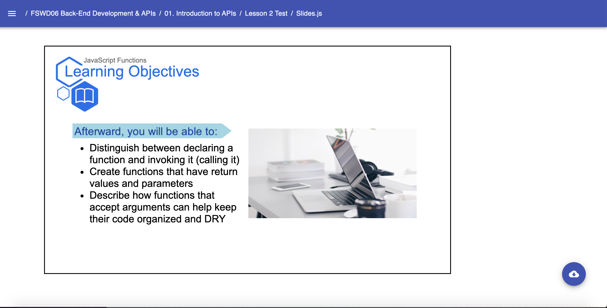

# Templates: LearningObjectives

* `LearningObjectives`
    * A Slides Template generally used after the Title component
    * Inherently a Media Slides Template with required Slide Header props:
        * `subtitle` - The name of the lesson (passed in a string value | string variable) for consistency throughout the lesson slides
        * `objectives` - An Array of the synopsis of what is covered in the lesson (seperated by commas), converted by CAT into an unordered list
    Example: 
    ```jsx
        // Near the top of your Slides.js file
        import { Presentation } from 'lib/components'
        import { LearningObjectives } from 'templates'  
        
        const LESSON_NAME = "JavaScript Functions"

        // ... later, when you begin writing content for your lesson:
            export default () => (
                <Presentation>
                    <LearningObjectives 
                        subtitle={LESSON_NAME}
                        objectives={[
                            "Distinguish between declaring a function and invoking it (calling it)",
                            "Create functions that have return values and parameters",
                            "Describe how functions that accept arguments can help keep their code organized and DRY"
                        ]}
                    />
                </Presentation>
            )
    ``` 
    Result: 
    