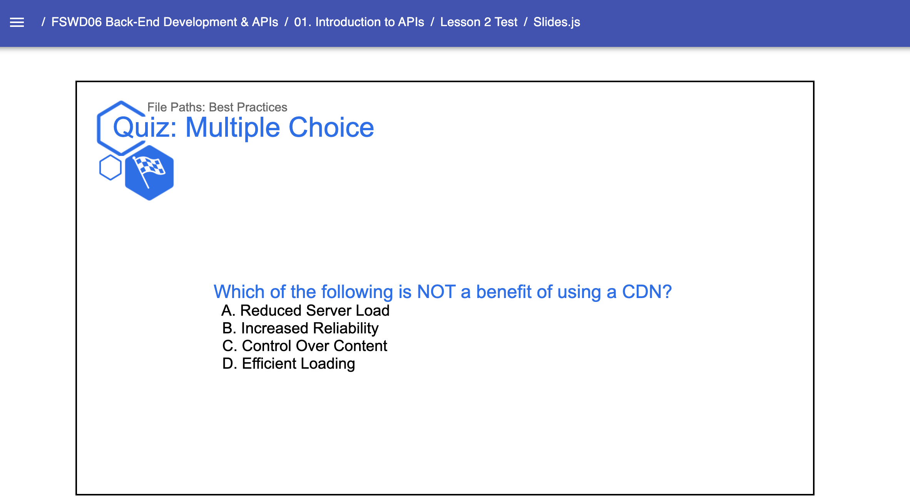
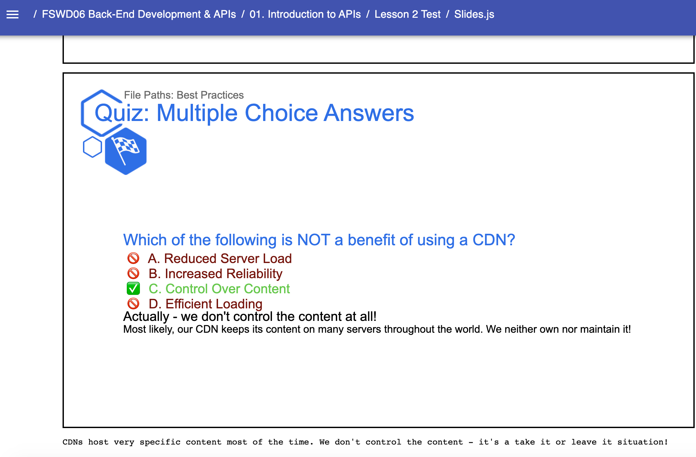

# Presentation Templates: Quiz.Slide

* `Quiz`
    * A Quiz Template that serves as a mix between a quick lesson-assessment & an opportunity to start a conversation around a particular topic.  This template is typically used back-to-back, the first time to pose the question and the second time to present the answer (Click the link for examples). Required components:
        * `Slide` - The required second-level component for creating presentations. Accepts internal components/props:
            * `Content` - The child second-level component that encases Typography components (`H1`-`H4`, `P`, etc.) and Media components
    Example: 
    ```jsx
        // Near the top of your Slides.js file
        import { H1, H2, H3, H4, Presentation, Span, } from 'lib/components'
        import { Text } from 'templates'

        const LESSON_NAME = "JavaScript Functions"

        // ... later, when you begin writing content for your lesson:
        export default () => (
            <Presentation>

                <Quiz.Slide title="Quiz: Multiple Choice" subtitle={LESSON_NAME} icon="checkered-flag">
                    <Quiz.Content>
                        <H2>Which of the following is NOT a benefit of using a CDN?</H2>
                        <H3>&nbsp;&nbsp;A. Reduced Server Load</H3>
                        <H3>&nbsp;&nbsp;B. Increased Reliability</H3>
                        <H3>&nbsp;&nbsp;C. Control Over Content</H3>
                        <H3>&nbsp;&nbsp;D. Efficient Loading</H3>
                    </Quiz.Content>
                </Quiz.Slide>  

                <Quiz.Slide title="Quiz: Multiple Choice Answers" subtitle={LESSON_NAME} icon="checkered-flag">
                    <Quiz.Content>
                        <H2>Which of the following is NOT a benefit of using a CDN?</H2>
                        <H3 style={{ color: '#800000' }}>&nbsp;🚫&nbsp;&nbsp;A. Reduced Server Load</H3>
                        <H3 style={{ color: '#800000' }}>&nbsp;🚫&nbsp;&nbsp;B. Increased Reliability</H3>
                        <H3 style={{ color: '#32CD32' }}>&nbsp;✅&nbsp;&nbsp;C. Control Over Content</H3>
                        <H3 style={{ color: '#800000' }}>&nbsp;🚫&nbsp;&nbsp;D. Efficient Loading</H3>
                        <H3>Actually - we don't control the content at all!</H3>
                        <P>Most likely, our CDN keeps its content on many servers throughout the world. We neither own nor maintain it!</P>
                    </Quiz.Content>
                    <SpeakerNotes>
                        CDNs host very specific content most of the time. We don't control the content - it's a take it or leave it situation!
                    </SpeakerNotes>
                 </Quiz.Slide>

            </Presentation>
        )
    ``` 
    Result: 
    
    