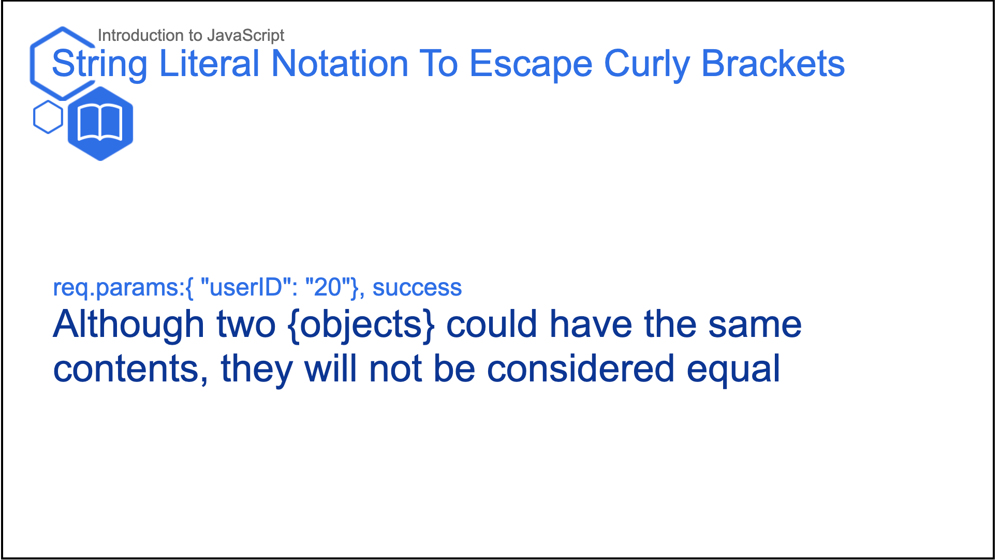

# Template Literal (Escape/Backtick) Notation

* If you're looking to include curly brackets {} in your Typography components, you will need to use String/Template literal notation to escape them and avoid running into errors. Don't fear, the implementation of this notation is very simple:
    *  Using backticks `` (below the escape button on most keyboards) allows for the curly bracket to be escaped and not interpreted as Javascript variable
    Example: 
    ```jsx
        // Import in at the top of your Slides.js file
        import { H1, H2, H3, H4, Presentation, Span, } from 'lib/components'
        import { Text } from 'templates'

        const LESSON_NAME = "Error Prevention"

        // ... later, when you begin writing content for your lesson:
        export default () => (
            <Presentation>

                <Text.Slide title="String Literal Notation To Escape Curly Brackets" subtitle={LESSON_NAME} icon="book">
                    <Text.Content>
                        <H2> {`req.params:{ "userID": "20"}, success`} </H2>

                        <H1>Although two {`{objects}`} could have the same contents, they will not be considered equal  </H1>
                    </Text.Content>
                </Text.Slide>

            </Presentation>
        )
    ``` 
    Result: 
    

    * If you attempted to use the ___