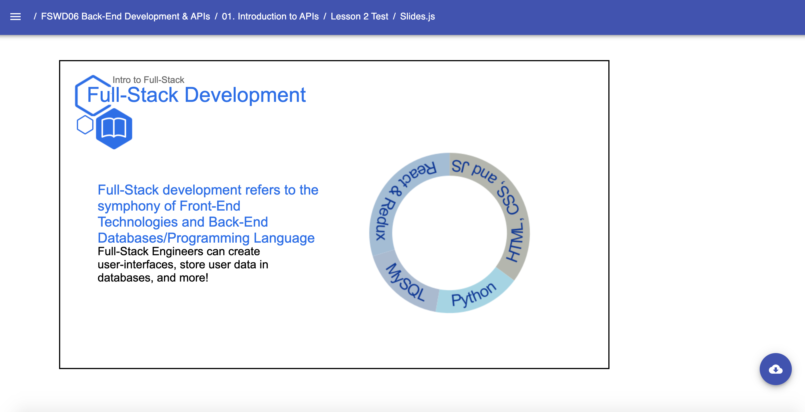

# Art Template: Circular Diagram

* `CircularDiagram`
    * Art Template that allows for a multipart circular diagram with various points through a single function. Required props:
        * `points` - takes in an array of the parts the circular diagram (see example below)
    * Must be used within a Parent container (Slide Template, Document, etc.)
    Example: 
    ```jsx
        // Near the top of your Slides.js file
        import { P, SpeakerNotes, Ul, Li, H2, H3, H4, Image, Link, Presentation, Span } from 'lib/components'
        import { Media } from 'templates'
        import { CircularDiagram } from 'templates/art'

        const LESSON_NAME = "Intro to Full-Stack"

        // ... later, when you begin writing content for your lesson:
        export default () => (
            <Presentation>

                <Media.Slide title="Full-Stack Development" subtitle={LESSON_NAME} icon="book">
                    
                    <Media.Content>
                        <CircularDiagram
                            points={[
                                'HTML, CSS, and JS',
                                'Python',
                                'MySQL',
                                'React & Redux',
                            ]}
                        />
                    </Media.Content>

                    <Media.Description>
                        <H2> Full-Stack development refers to the symphony of Front-End Technologies and Back-End Databases/Programming Language </H2>
                        <H3> Full-Stack Engineers can create user-interfaces, store user data in databases, and more!</H3>
                    </Media.Description>
                </Media.Slide>


            </Presentation>
        )
    ``` 
    Result: 
    