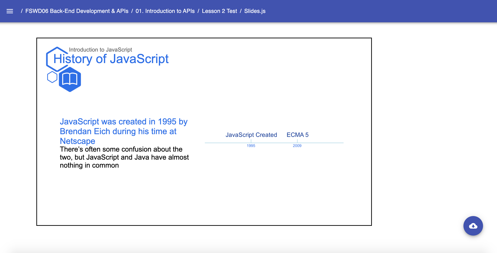

# Art Template: Timeline & Point

* `Timeline`
    * Art Template that creates a timeline with date points. Required props:
        * `format` - The time format is required (example: `Timeline format="yyyy"` for timeline points noted in year format)
    * `Point` - Required second level component that creates a point in the timeline. Required props:
        * `date` - inserts the point at that date in the timeline
    Example: 
    ```jsx
        // Near the top of your Slides.js file
    import { P, SpeakerNotes, Ul, Li, H2, H3, H4, Image, Link,  Presentation, Span } from 'lib/components'
    import { Media } from 'templates'
    import { Timeline } from 'templates/art'
    
    const LESSON_NAME = "Introduction to JavaScript"
    
    // ... later, when you begin writing content for your lesson:
    export default () => (
        <Presentation> 
            <Media.Slide title="History of JavaScript" subtitle={LESSON_NAME} icon="book">
                
                <Media.Content> 
                    <Timeline format="yyyy">
                       <Timeline.Point date="1995">
                           JavaScript Created
                       </Timeline.Point>
                       <Timeline.Point date="2009">
                           ECMA 5
                       </Timeline.Point>
                    </Timeline> 
                </Media.Content>
            
                <Media.Description>
                    <H2> JavaScript was created in 1995 by Brendan Eich during his time at Netscape </H2>
                    <H3> There’s often some confusion about the two, but JavaScript and Java have almost nothing in common </H3>
                </Media.Description>
            
            </Media.Slide>
        </Presentation>
    )
    ``` 
    Result: 
    
        