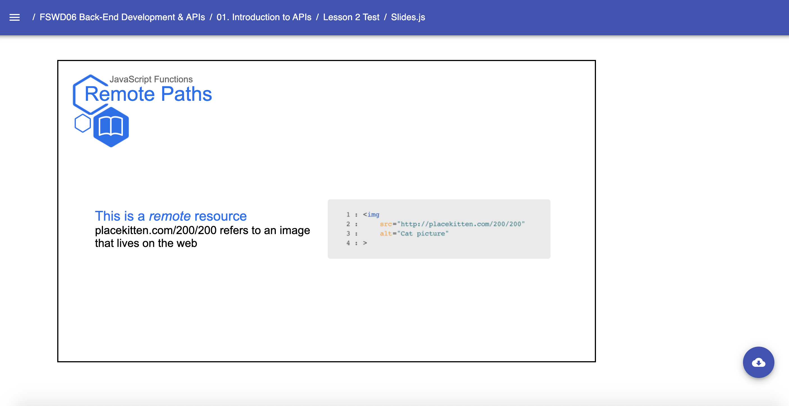

# Templates: Code.Slide

* `Code` 
    * A Slides Template used to create code-based presentation slides. Required components:
        * `Slide` - The required second-level component for creating presentations. Accepts internal components/props:
            * `Content` - The child second-level component that encases Code Snippets (`CodeSnippet` tag with the desired language after)
            * `Description` - The child second-level component that encases Typography (text related components such as `H2`, `H3`)
    Example: 
    ```jsx
        // Near the top of your Slides.js file
        import { H1, H2, H3, H4, Presentation, Span, } from 'lib/components'
        import { Code } from 'templates'

        const LESSON_NAME = "JavaScript Functions"

        // ... later, when you begin writing content for your lesson:
        export default () => (
            <Presentation>

                <Code.Slide title="Remote Paths" subtitle={LESSON_NAME} icon="book">
                    <Code.Content>
                        <CodeSnippet language="html">{`
                            `}</CodeSnippet>
                    </Code.Content>
                    <Code.Description>
                        <H2>This is a <Span italic>remote</Span> resource</H2>
                        <H3>placekitten.com/200/200 refers to an image that lives on the web</H3>
                    </Code.Description>
                </Code.Slide>

            </Presentation>
        )
    ``` 
    Result: 
    