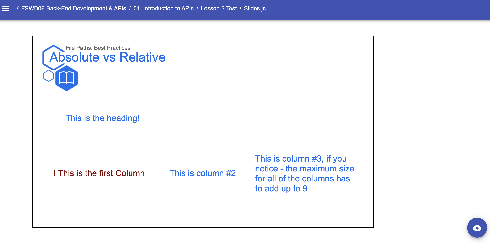

# Presentation Templates: Column.Slide

* `Column`
    * A Column Template used to create presentation slides that can be broken upto 8 sections of desired sizes that must be explicity stated in the (`Slide`) component. 
    NOTE: The size for each individual column must also be explicitly stated as a prop and must equal the size that was assigned in the parent (`Slide`) prop. (See Example By Clicking On The Link!). Required components:
        * `Slide` - The required second-level component for creating presentations. Accepts internal components/props:
            * `Heading` - The child second-level component that encases Typography components (`H1`-`H4`, `P`, etc.) and Media components
            * `One`, `Two`, `Three`, ... `Eight` - The child second-level component that creates columns that encase Typography components. Accepts required props:
                * `size` - The size property for that column.
    Example: 
    ```jsx
        // Near the top of your Slides.js file
        import { H1, H2, H3, H4, Presentation, Span, } from 'lib/components'
        import { Column } from 'templates'

        const LESSON_NAME = "Column"

        // ... later, when you begin writing content for your lesson:
        export default () => (
            <Presentation>

                <Column.Slide title="Absolute vs Relative" subtitle={LESSON_NAME} icon="book" columns={9}>
                    
                    <Column.Heading>
                        <H2>This is the heading!</H2>
                    </Column.Heading>
        
                    <Column.One size={3}>
                        <H2 style={{ color: '#800000' }}><Span bold>!</Span> This is the first Column</H2>
                    </Column.One>
        
                    <Column.Two size={3}>
                        <H2>This is column #2</H2>
                    </Column.Two>
        
                    <Column.Three size={3}>
                        <H2>This is column #3, if you notice - the maximum size for all of the columns has to add up to 9 </H2>
                    </Column.Three>
                </Column.Slide>

            </Presentation>
        )
    ``` 
    Result: 
    