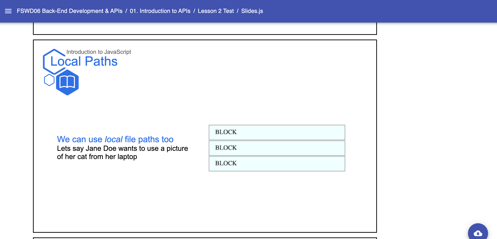

# Templates: Media.Slide

* `Media`
    * A Slides Template used to create media-based presentation slides. Required components:
        * `Slide` - The required second-level component for creating presentations. Accepts internal components/props:
            * `Content` - The child second-level component that encases Media (`Image`, etc.) & Typography (`H2`, `Link`, etc.) Components 
            * `Description` - The child second-level component that encases Typography (text related components such as `H2`, `H3`) describing the media content or lesson
    Example: 
    ```jsx
        // Near the top of your Slides.js file
        import { H2, H3, H4, Image, Link, Presentation, Span } from 'lib/components'
        import { Media } from 'templates'
        import path from 'path'

        const LESSON_NAME = "File Paths: Best Practices"

        // ... later, when you begin writing content for your lesson:
        export default () => (
            <Presentation>

                <Media.Slide title="Local Paths" subtitle={LESSON_NAME} icon="book">
                    <Media.Content>
                        <H4>
                            <Link href="http://placekitten.com/200/300">Click here for cat pics</Link>
                        </H4>
                    </Media.Content>
                    <Media.Description>
                        <H2>We can use <Span italic>local</Span> file paths too</H2>
                        <H3> Lets say Jane Doe wants to use a picture of her cat from her laptop </H3>
                    </Media.Description>
                </Media.Slide>

            </Presentation>
        )
    ``` 
    Result: 
    