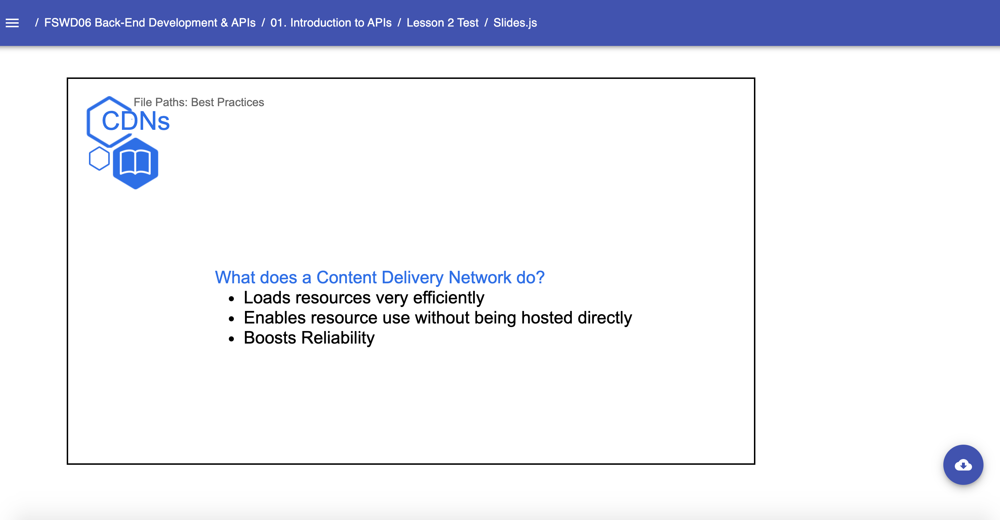

# Templates: Text.Slide

* `Text`
    * A Slides Template used to create text-based presentation slides. Required components:
        * `Slide` - The required second-level component for creating presentations. Accepts internal components/props:
            * `Content` - The child second-level component that encases Typography components (`H1`-`H4`, `P`, etc.) and Media components
    Example: 
    ```jsx
        // Near the top of your Slides.js file
        import { H1, H2, H3, H4, Presentation, Span, } from 'lib/components'
        import { Text } from 'templates'

        const LESSON_NAME = "JavaScript Functions"

        // ... later, when you begin writing content for your lesson:
        export default () => (
            <Presentation>

                <Text.Slide title="CDNs" subtitle={LESSON_NAME} icon="book">
                    <Text.Content>
                        <H2>What does a Content Delivery Network do?</H2>
                        <Ul>
                            <Li>Loads resources very efficiently</Li>
                            <Li>Enables resource use without being hosted directly</Li>
                            <Li>Boosts Reliability</Li>
                        </Ul>
                    </Text.Content>
                </Text.Slide>

            </Presentation>
        )
    ``` 
    Result: 
    
