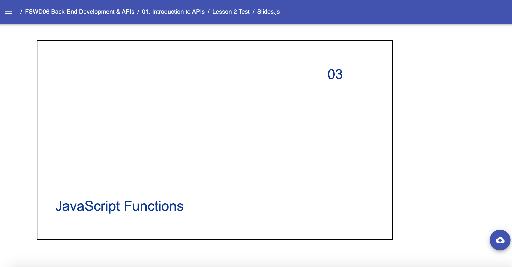

# Templates: Title.Slide

* `Title`
    * A Slides Template used in the beginning of each presentation, creating the title slide. Required components:
        * `Slide` - The required second-level component for creating presentations. Required props:
            * `title` - Presents the title of the lesson in the title slide - stored in a string
            * `moduleNumber` - Presents the Module Number of the lesson to help students and instructors keep track of content
    Example: 
    ```jsx
        // Near the top of your Slides.js file
        import { Presentation } from 'lib/components'
        import { Title } from 'templates'

        const LESSON_NAME = "JavaScript Functions"

        // ... later, when you begin writing content for your lesson:
            export default () => (
                <Presentation>
                    <Title.Slide
                        title={LESSON_NAME}
                        moduleNumber="03"
                     />
                </Presentation>
            )
    ``` 
    Result: 
    