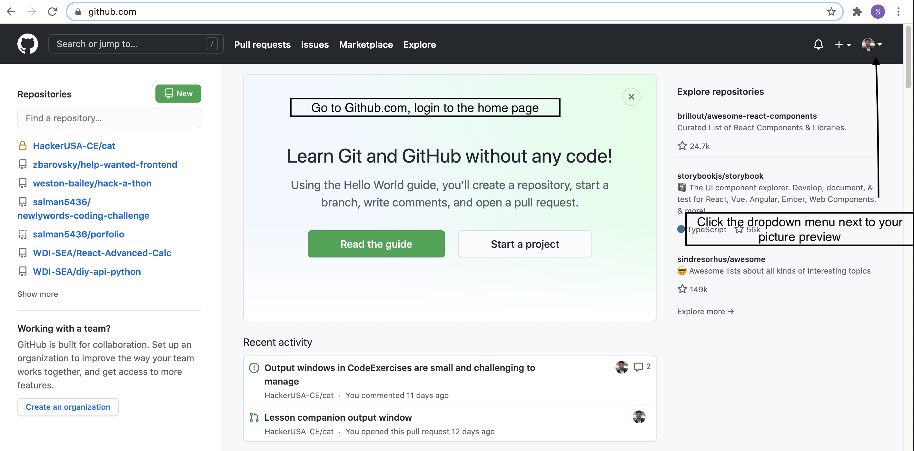
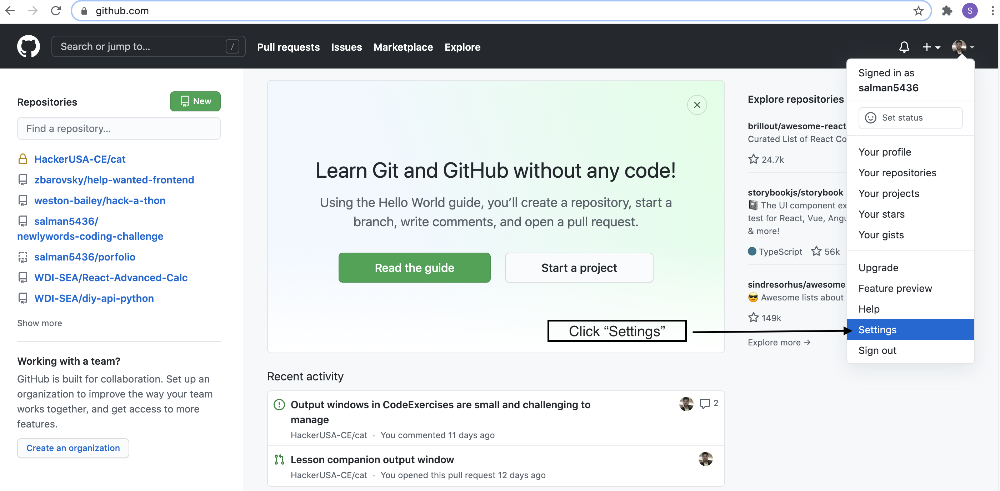
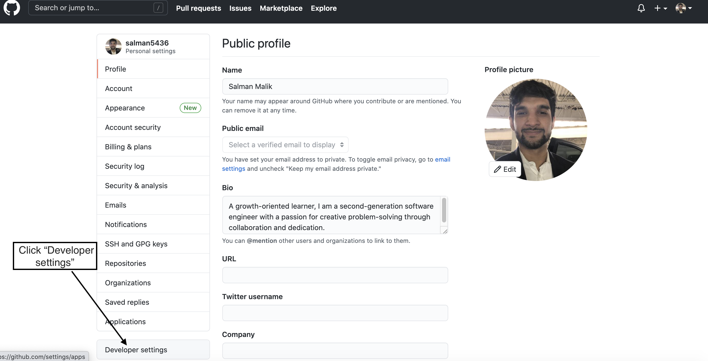
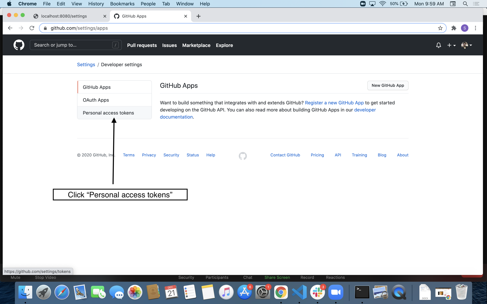
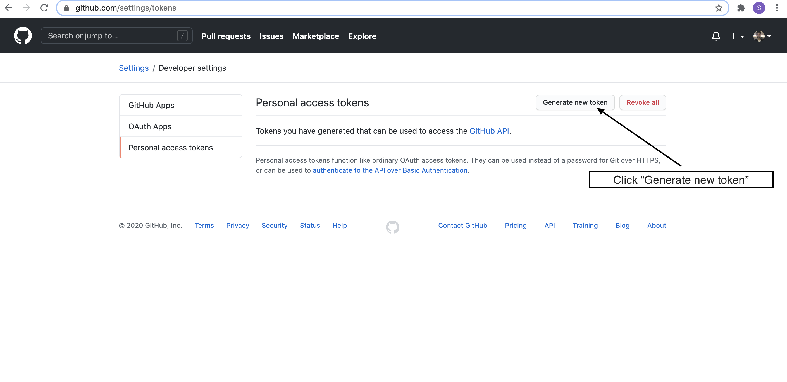
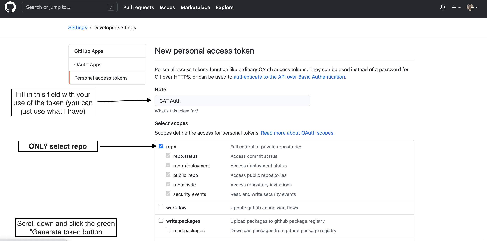
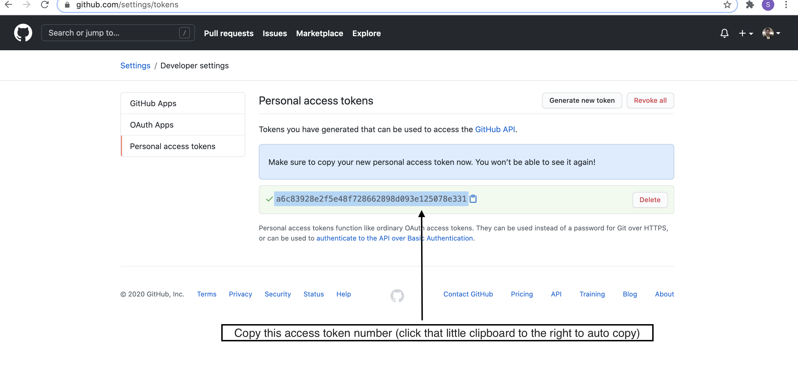
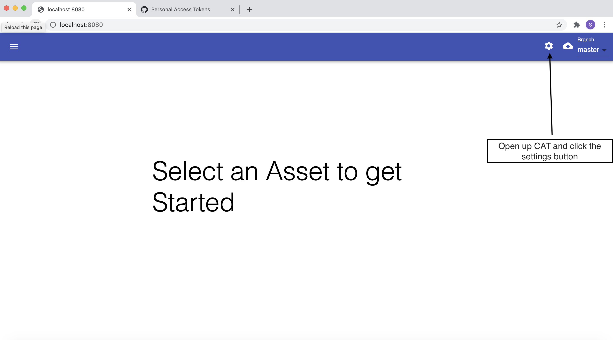
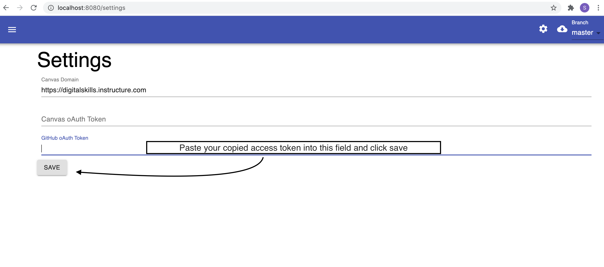

## Here is a step-by-step tutorial for creating your personal oAuth token!
* Be sure to follow each step carefully and read the proper instructions. Feel free to reach out on Slack if any errors present themselves.
    Result:
      
    &nbsp;  

    
    &nbsp;  

    
    &nbsp;   

    
    &nbsp;  

    
    &nbsp;  

    
    &nbsp;  

    
    &nbsp;  

    
    &nbsp;  

    
    