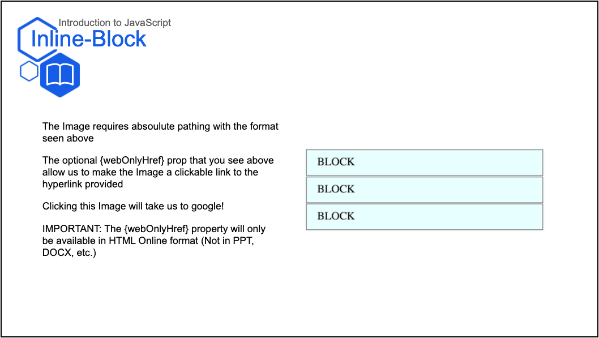

* `Image`
    * For images. Accepts props:
        * `path` - path to an image to display; should be relative to the current file
        * `buffer` - alternatively, you may supply an image buffer
        * `width` - (optional) the width of the image
        * `height` - (optional) the height of the image
        * `x` - (optional) the horizontal position of the Image
        * `y` - (optional) the vertical position of the Image
        * `webOnlyHref` - (optional) hyperlink to external web source, creating a link to be accessed by clicking the Image. NOTE: This property is only available for web HTML usage (will NOT apply to any exported formats)
    * The image will be sized:
        * By default: according to the size in the file, scaled down to the width of the page
        * If one dimension is provided, (width or height) scaled relative to that dimension to maintain aspect ratio
        * If both dimensions are provided, (width and height) arbitrarily, changing the aspect ratio if necessary 
      ```jsx
        // Import in at the top of your Slides.js file
        import { H1, H2, H3, H4, Presentation, Span, Image, P } from 'lib/components'
        import { Text, Media } from 'templates'
        import path from 'path'

        const LESSON_NAME = "Error Prevention"

        // ... later, when you begin writing content for your lesson:
        export default () => (
            <Presentation>

                <Media.Slide title="Inline-Block" subtitle={LESSON_NAME} icon="book">
                    <Media.Content>
                        <Image path={path.resolve(__dirname + "/assets/block.png")} webOnlyHref={"https://www.google.org/"}/>
                    </Media.Content>
                    <Media.Description>
                            <P>The Image requires absoulute pathing with the format seen above - remember to import path at the top of your slide.js file</P>
                            <P> </P>

                            <P>The optional {`{webOnlyHref}`} prop that you see in the Image tag above allow us to make the Image a clickable link to the hyperlink provided</P>
                            <P> </P>

                            <P>Clicking the Image will take us to google!</P>
                            <P> </P>

                            <P>IMPORTANT - The {`{webOnlyHref}`} property will only be available in HTML online format (Not in PPT, DOCX, etc.)</P>
                    </Media.Description>
                </Media.Slide>

            </Presentation>
        )
    ``` 
    Result: 
    