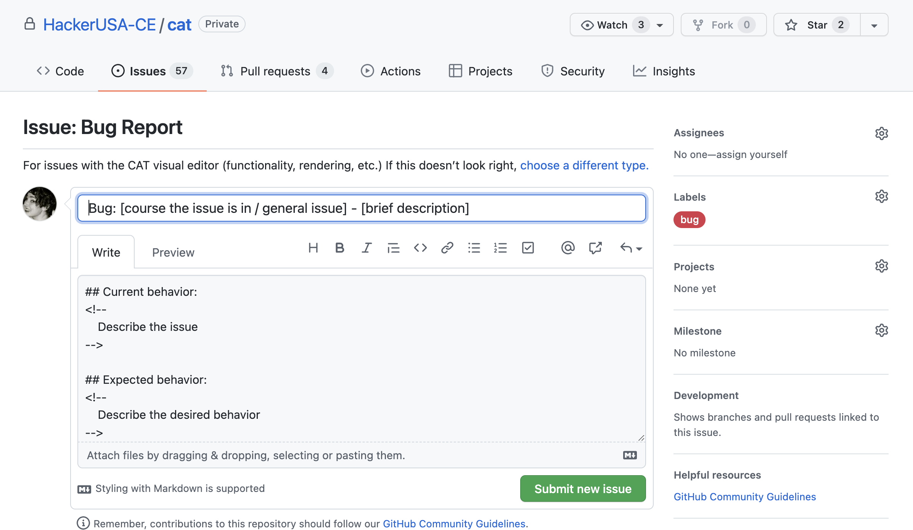

## Making an issue

- casual questions generally go to the slack channels.
- Look through the issues and see if you have a similar issues
- Documentation issues/suggestions 

## Git Workflow
- [ ] branching ( using terminal to create new branch, initial push to not have that persistent error, and pushing/committing through CAT, and PRing as necessary)

## Using the CAT GUI

- [ ] Escaping characters in JSX (rr-2-create-a-craigslist clone)
- [ ] Highlighting text
- [ ] File structures
    - [ ] Adding a course (manually)
- [ ] Code snippets

## Deployments

## Misc notes
- [ ] File Structure: Adding a lesson or module (manually or what happens when you add a lesson or module)
- [ ] List Items Indenting (how indenting works)
- [ ] How linking hrefs works (through code highlight selection Span stuff)
- [ ] CodeSnippets (arrows, highlighting, code underline AKA ev),
- [ ] Exercise Components: Short Answer, Code Exercise, MCQ
- [ ] Repository Setup (stuff used in activities)
- [ ] For new CAT stuff, we mostly want to talk about the props and what they do
---

#### [Getting CAT](getting-started.md) | [Using CAT](using-cat.md) | [Deployment to Canvas](deployments.md) | [Git Workflow with CAT](git-workflow.md) | [Issues](cat-issues.md) | [FAQ](faq.md)

# Issues

This page will walk you through what to do if you have an issue with CAT.

### Step One — Due Diligence 

Go through the [CAT issues](https://github.com/HackerUSA-CE/cat/issues) page and read the titles. If there is an issue that sounds **similar** to yours, please add your comment to that issue instead of filing a new issue. This allows the CAT developers to more efficiently escalate and solve problems. This also gives you clarity if an issue is in progress or even solved and will be implemented in the next deployment. If you are unable to read through all of the issues, at least read through the issues filed in the last three months.

### Step Two — Choosing a Template

One you have determined that your issue is not a duplicate, you can create a new issue. This will take you to a page with templates to choose from. There are four templates with descriptions that will help you determine which to choose. They are:
* **Bug Report**: *For issues with the CAT visual editor (functionality, rendering, etc.)*
* **Deployment Issue**: *For issues with curriculum deployment through CAT (Canvas missing curriculum or curriculum rendering incorrectly on Canvas, etc.)*
* **Feature request**: *Enhancement/feature ideas for the CAT editor*
* **Other**: *For issues that do not fit any other category*

### Step Two — Filling Out the Templates

Once you choose a template, you will be taken to a template issue with sections for you to fill out. 

#### Labels

On the right under `labels` you will see a label will already be loaded; go through the list of labels and apply any that might additionally be relevant; each label also has a description for you to read to ensure that you are applying it correctly. A list of the labels and their descriptions can be found [here](https://github.com/HackerUSA-CE/cat/issues/labels).

### In Progress