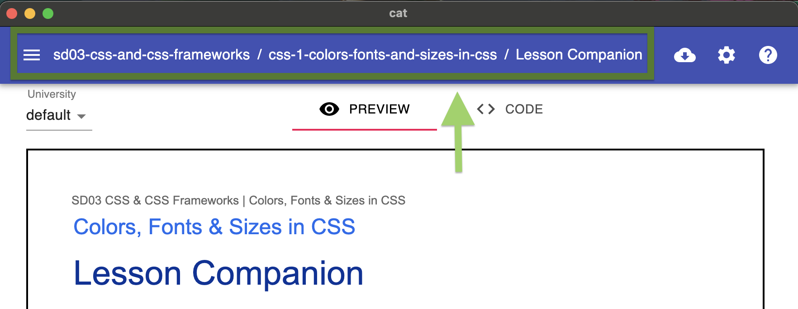
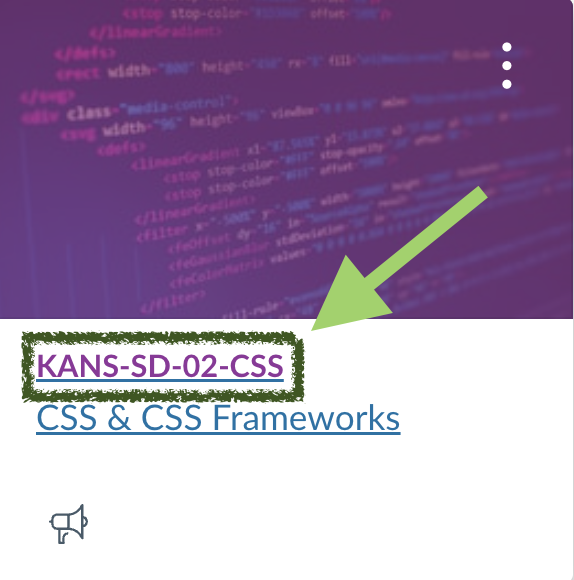

#### [Getting CAT](getting-started.md) | [Using CAT](using-cat.md) | [Deployment to Canvas](deployments.md) | [Git Workflow with CAT](git-workflow.md) | [Issues](cat-issues.md) | [FAQ](faq.md)

# Issues

This page will walk you through what to do if you have an issue with CAT.

### Step One — Due Diligence 

Go through the [CAT issues](https://github.com/HackerUSA-CE/cat/issues) page and read the titles. If there is an issue that sounds **similar** to yours, please add your comment to that issue instead of filing a new issue. This allows the CAT developers to more efficiently escalate and solve problems. This also gives you clarity if an issue is in progress or even solved and will be implemented in the next deployment. If you are unable to read through all of the issues, at least read through the issues filed in the last three months.

### Step Two — Choosing a Template

One you have determined that your issue is not a duplicate, you can create a new issue. This will take you to a page with templates to choose from. There are four templates with descriptions that will help you determine which to choose. They are:
* **Bug Report**: *For issues with the CAT visual editor (functionality, rendering, etc.)*
* **Deployment Issue**: *For issues with curriculum deployment through CAT (Canvas missing curriculum or curriculum rendering incorrectly on Canvas, etc.)*
* **Feature request**: *Enhancement/feature ideas for the CAT editor*
* **Other**: *For issues that do not fit any other category*

### Step Two — Filling Out the Templates

Once you choose a template, you will be taken to a template issue with sections for you to fill out. 

The issue page will come pre-loaded with some text; anything in `[]` you will want to update.

#### Title

Each template requires you to fill out a breif description of the issue/request while the Bug Report and Deployment templates also have a location aspect to the title. If you are filing a Bug Report or Deployment issue, you will need to indicate if there is a specific place you are experiencing it or if its general. General issues are issues that you or your team have experienced in multiple locations. If you have only experienced it in one area but think it may be a general issue, please put the specific location instead of general; others may comment if they are experiencing the same issue in a different location.

##### Curriculum location
If your issue is within the CAT editor, the "course the issue is in" can be found in the breadcrumbs at the top of your CAT editor: 

##### Class location
If your issue is within Canvas, the "course the issue is in" can be found in the cards on your dashboard:

#### Body

The body of the issue has a few sections for you to fill out (indicated by the syntax `##`).

- Current behavior: describe what is currently happening
- Expected behavior: describe what you think should be happening
- Steps to reproduce: specify how to reproduce the bug; screenshots are *very* helpful and should be added here
- Issue checklist: check off these boxes either after submitting the issue or before (by putting an x between the square brackets). **Issues will not be addressed until all of these steps have been completed by the issue creator.**

#### Labels

On the right under `labels` you will see a label will already be loaded; go through the list of labels and apply any that might be relevant; each label also has a description for you to read to ensure that you are applying it correctly. A list of the labels and their descriptions can be found [here](https://github.com/HackerUSA-CE/cat/issues/labels).
